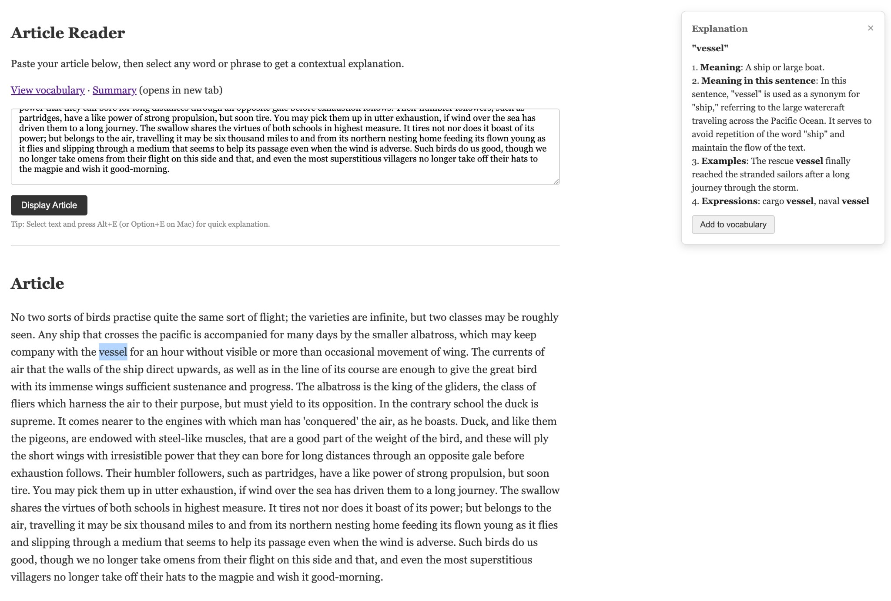

# Article Reader with Contextual LLM Word Explanation



A minimal local web app for reading articles. Select any word or phrase to get a concise, context-aware explanation from an LLM.

## Setup

```bash
pip install -r requirements.txt
```

## Configuration

Create a `.env` file in the project root (copy from `.env.example`):

```
GEMINI_API_KEY=your-gemini-api-key
```

Get a key at https://aistudio.google.com/apikey

**Security:** Never commit `.env` — it's in `.gitignore`. Your key stays local only.

Optional: `GEMINI_MODEL` – model name (default: `gemini-2.5-flash`)

## Run

```bash
uvicorn main:app --reload
```

Open http://127.0.0.1:8000

## Usage

1. Paste your article into the text area
2. Click "Display Article"
3. Select a word or phrase while reading
4. The explanation appears in a panel on the right
5. Or press **Alt+E** (Option+E on Mac) after selecting text
