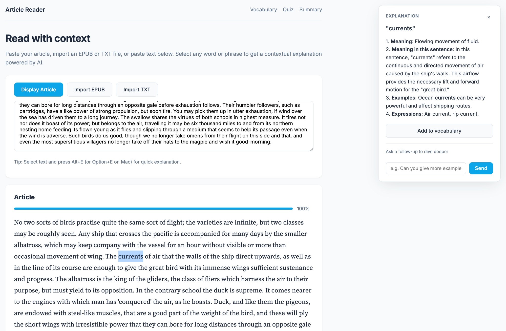
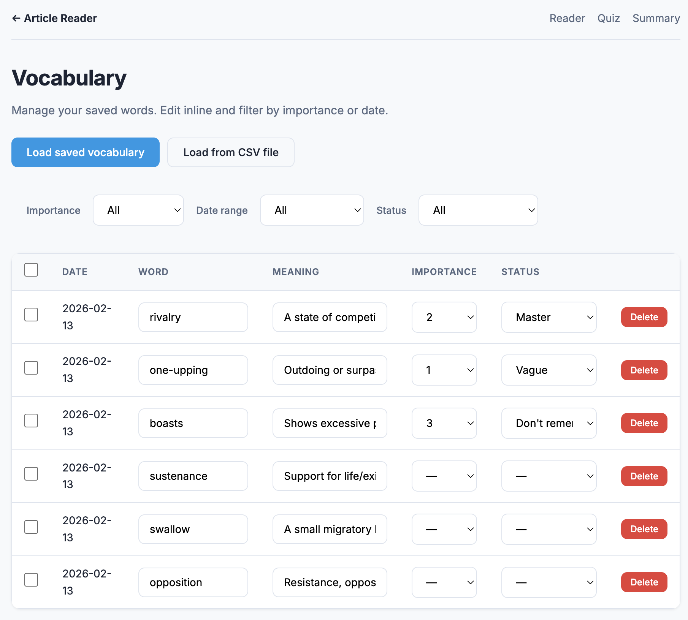
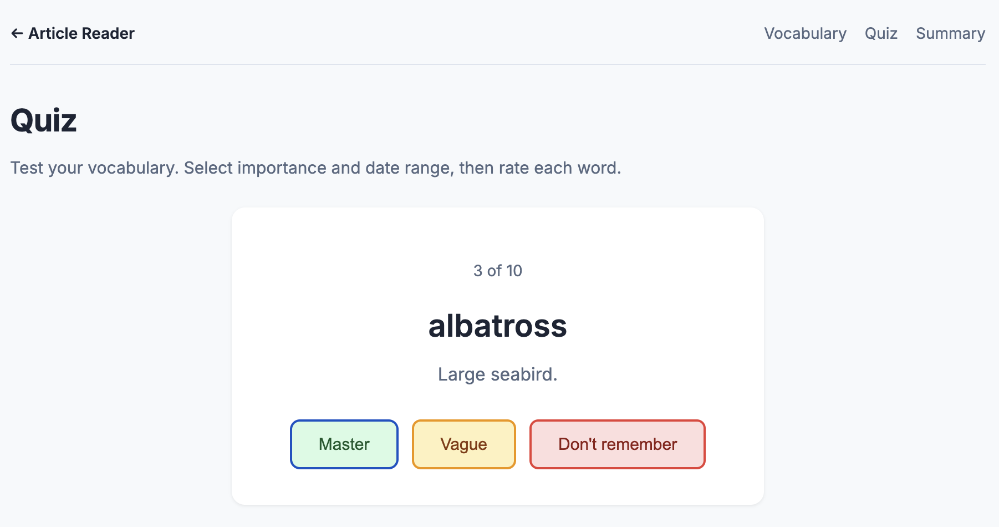

# Article Reader

Read anything, tap any word for instant AI explanations, and build a vocabulary you'll actually remember—with quizzes that stick.



## Features

- **Read** — Paste text or import EPUB/TXT files
- **Explain** — Select any word or phrase for contextual AI explanation (Gemini or OpenAI)
- **Chat** — Ask follow-up questions to dive deeper; keep the conversation going with the LLM
- **Vocabulary** — Save words, set importance, filter by date and status
- **Quiz** — Test yourself: see a word, rate recall (Master/Vague/Don't remember), then reveal the meaning
- **Progress** — Reading position and progress bar for EPUBs

## Setup

```bash
pip install -r requirements.txt
```

## Configuration

Create a `.env` file (copy from `.env.example`). Set **one** of:

| Provider | Variable | Get key |
|----------|----------|---------|
| Gemini (preferred) | `GEMINI_API_KEY` | [aistudio.google.com/apikey](https://aistudio.google.com/apikey) |
| OpenAI | `OPENAI_API_KEY` | [platform.openai.com/api-keys](https://platform.openai.com/api-keys) |

**Security:** `.env` is in `.gitignore` — your key stays local.

**Optional:** `GEMINI_MODEL`, `OPENAI_MODEL`, `OPENAI_BASE_URL` (for Ollama, etc.)

## Run

```bash
uvicorn main:app --reload
```

Open http://127.0.0.1:8000

## Usage

### Reading

1. Paste your article or click **Import EPUB** / **Import TXT** to load a file
2. Click **Display Article** (EPUB imports show automatically)
3. Select a word or phrase → explanation appears in the right panel
4. Press **Alt+E** (Option+E on Mac) for quick explanation
5. Use the follow-up chat to ask more (e.g. "Can you give more examples?") — the LLM keeps context
6. Click **Add to vocabulary** to save words

### Vocabulary

- **View vocabulary** — Load saved words, edit inline, filter by importance, date, or status
- **Import/export** — Load from CSV or manage the `vocabulary.csv` file directly

### Quiz

1. Choose importance and date range filters
2. Start quiz — 10 random words per round
3. See the word, choose Master / Vague / Don't remember
4. Meaning appears after your answer; status is saved to vocabulary

## Screenshots

**Article Reader** — Read articles, get AI explanations, chat with the LLM to dive deeper, add to vocabulary


**Vocabulary** — Manage saved words, filter by importance and status



**Quiz** — Test recall, rate each word, update status


